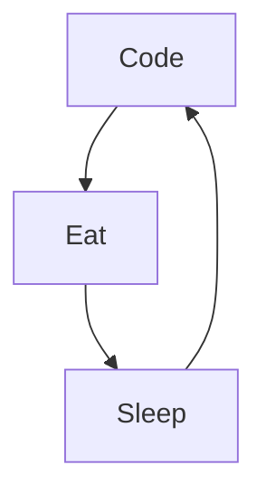

# Grégory Caloin

I'm Greg from France, Front-end developper and new tech addict. I really enjoy learning languages and frameworks like JS and React.

Actually:

- 🔭 I’m currently working on a new personal Project ...
- 🌱 I’m currently learning amazing things ...
- 👯 I help people to be programmers on Code platforms ...
- ⚡ Fun fact : I love Diving, Skateboarder and Surfer
- 📫 How to reach me: LinkedIn or email

### Connect with me:

  

  

### Languages and Tools:

[]
[]

### My daily routine :

### 🔥 Recent GitHub Activity

<!--START_SECTION:activity-->

1. 🎉 Merged PR [#2](https://github.com/MikeCodeur/react-netflix-clone/pull/2) in [MikeCodeur/react-netflix-clone](https://github.com/MikeCodeur/react-netflix-clone)
2. 💪 Opened PR [#2](https://github.com/MikeCodeur/react-netflix-clone/pull/2) in [MikeCodeur/react-netflix-clone](https://github.com/MikeCodeur/react-netflix-clone)
3. 🎉 Merged PR [#1](https://github.com/MikeCodeur/react-netflix-clone/pull/1) in [MikeCodeur/react-netflix-clone](https://github.com/MikeCodeur/react-netflix-clone)
4. 💪 Opened PR [#1](https://github.com/MikeCodeur/react-netflix-clone/pull/1) in [MikeCodeur/react-netflix-clone](https://github.com/MikeCodeur/react-netflix-clone)
5. 🎉 Merged PR [#9](https://github.com/MikeCodeur/react-hooks-avances/pull/9) in [MikeCodeur/react-hooks-avances](https://github.com/MikeCodeur/react-hooks-avances)
<!--END_SECTION:activity-->

### ⭐ GitHub Stats

